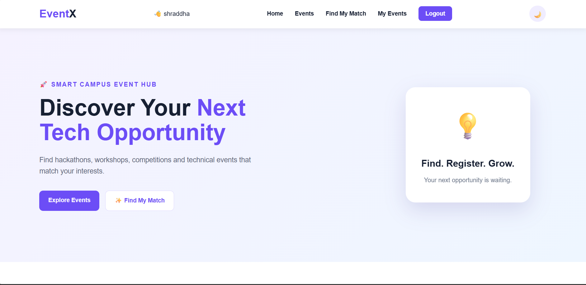
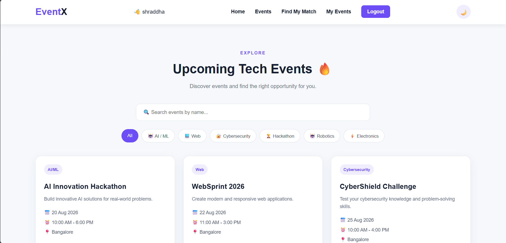
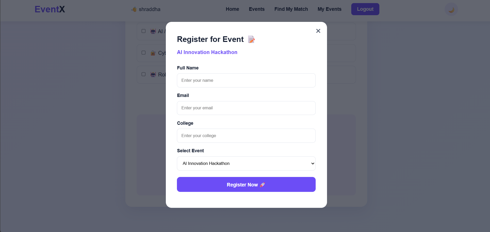
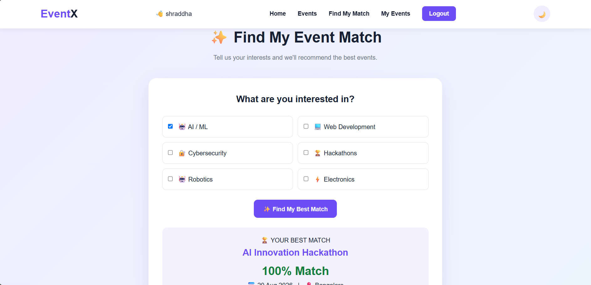
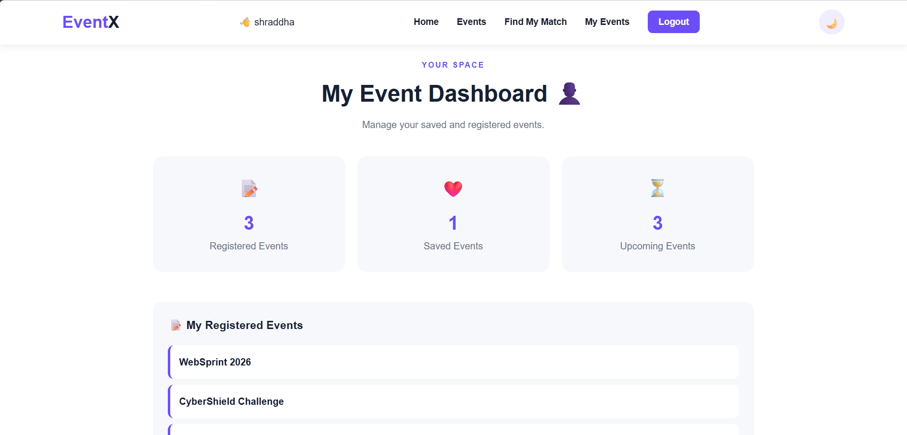
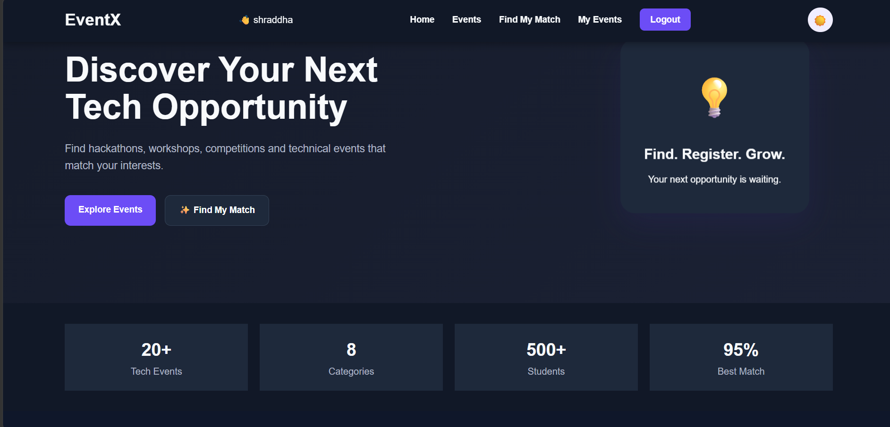

# 🚀 EventX – Smart Campus Event Hub

## 📌 About the Project

**EventX** is a Smart Campus Event Management Portal designed to help college students discover and participate in technology-related events such as hackathons, coding competitions, workshops, robotics events, AI/ML events, cybersecurity challenges, and electronics events.

The platform brings different technical opportunities together in one place and helps students find events based on their interests.

---

## 🎯 Problem Statement

Students often have to search through different websites and platforms to find college tech events, hackathons, competitions, and workshops.

EventX provides a single platform where students can:

* Discover upcoming technical events
* Search for events
* Filter events by category
* Find events based on their interests
* Register for events
* Save events for later
* Manage registered and saved events

---

## 💡 Key Features

### 🏠 Home Page

* Attractive landing page
* Event highlights
* Quick navigation to important sections
* Call-to-action buttons

### 🔎 Search Events

Students can search events by:

* Event name
* Category
* Description

### 🏷️ Category Filters

Events can be filtered by:

* AI / ML
* Web Development
* Cybersecurity
* Hackathon
* Robotics
* Electronics

### 📝 Event Registration

Students can register for events by entering:

* Full Name
* Email
* College
* Selected Event

The form also includes validation to prevent incomplete or invalid submissions.

### ✨ Find My Event Match

This is the main custom feature of EventX.

Students select their interests, and the system calculates which available event matches their interests best.

### ❤️ Save Events

Students can save interesting events and view them later from the **My Events Dashboard**.

### 👤 My Event Dashboard

The dashboard displays:

* Registered Events
* Saved Events
* Upcoming Events

### ⏳ Event Countdown

Each event displays a live countdown showing the remaining time until the event starts.

### ⚠️ Event Clash Detection

The system checks whether a newly selected event overlaps with an event the student has already registered for.

### 🌙 Dark Mode

Users can switch between light mode and dark mode.

The selected theme is stored using Local Storage.

### 💾 Local Storage

Local Storage is used to maintain:

* Login information
* Saved events
* Registered events
* Selected theme

This allows the application to retain important user data after refreshing the page.

### 📱 Responsive Design

The website is designed to work across:

* Desktop
* Laptop
* Tablet
* Mobile screens

---

## 🛠️ Technologies Used

* **HTML5** – Website structure
* **CSS3** – Styling, responsive design and animations
* **JavaScript** – Application logic and interactive features
* **Local Storage** – Client-side data storage

---

## 📂 Project Structure

```text
EventX/
│
├── index.html
├── login.html
├── main.js
├── style.css
├── README.md
│
└── screenshots/
    ├── darkmode.png
    ├── dashboard.png
    ├── desktop_responsive.png
    ├── events.png
    ├── localstorage.png
    ├── match.png
    ├── phone_responsive.png
    ├── registration.png
        
        

```

---

## ▶️ How to Run the Project

1. Download or clone the EventX project.
2. Keep all files in the same project folder.
3. Open `login.html` in a web browser.
4. Enter a username and password.
5. Click **Login**.
6. Explore the EventX portal.

For the best experience, run the project using a local development server such as VS Code Live Server.

---

## 🔄 How EventX Works

```text
Login
   ↓
Home Page
   ↓
Explore Events
   ↓
Search / Filter Events
   ↓
Find My Event Match
   ↓
Save or Register
   ↓
My Event Dashboard
```

---

## ⭐ Highlights

* 8 sample technical events
* Personalized event matching
* Event search and category filtering
* Event registration
* Saved events
* Registration clash detection
* Live event countdown
* Dashboard
* Dark mode
* Responsive user interface
* Local Storage support

---

## 🎨 UI & Design

EventX uses a modern and student-friendly interface with:

* Clean event cards
* Interactive buttons
* Smooth animations
* Responsive layouts
* Light and dark themes
* Simple navigation

---

## 📸 Screenshots

Screenshots of the project are available in the `screenshots` folder.

### 🏠 Home Page



### 🔎 Events



### 📝 Registration



### ✨ Find My Match



### 👤 My Events Dashboard



### 🌙 Dark Mode



---

## 🚀 Future Improvements

Possible future improvements include:

* Backend database integration
* Real-time event data
* Student accounts with secure authentication
* Event organizer dashboard
* Email notifications
* Online event registration links
* More advanced recommendation algorithms
* Admin panel for managing events

---

## 👩‍💻 Project

**Project Name:** EventX
**Project Type:** Smart Campus Event Management Portal
**Built With:** HTML, CSS & JavaScript

---

## 📄 License

This project was created as a student project for learning, development, and hackathon purposes.
### Netlify Link:
https://melodious-banoffee-3d069e.netlify.app
